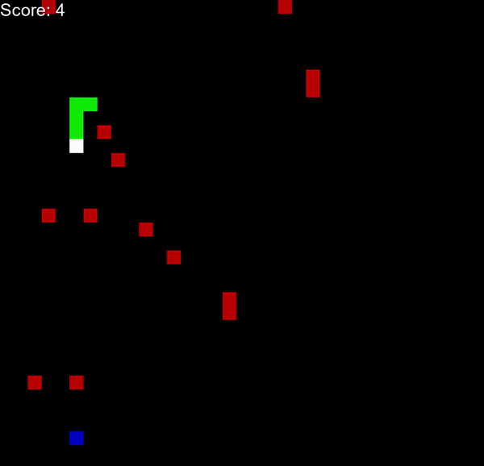

# SnakeAIs

<!-- TOP -->
<div id="top"></div>

<!-- INTRODUCTION -->
SnakeAIs (`Snakeyes`) is a recreation of the famous snake game using Python( famous for those who have witnessed the keypad era of mobile phones).
Traditionally in this game, a player assumes the role of a snake that has to manoeuvre around a grid to collect food and also avoid hitting obstacles in the process.
As the game progresses and the snake collects more food, its speed and size increase making it difficult for the player to efficiently manoeuvre the snake.
The objective here is to collect as many food items as possible before colliding with the obstacles, the walls of the grid or any part of the snake itself.

SnakeAIs puts a twist on the traditional snake game by using various `state-space search algorithms` that generate paths for the snake to traverse the grid and collect food.
The idea behind this project was to understand how these algorithms work by applying them to a game for better visualization and comparison.
The ultimate objective is to create gamified informational website for explaining each of these state-space algorithms though examples based on the game.

<!-- DEMO GIF -->
<br/>
<div align="center">
      
</div>
<br/>

<!-- TABLE OF CONTENTS -->
<details>
      <summary>Table of Contents</summary><br/>
      <ul>
            <li><a href="#installation">Installation</a></li>
            <li><a href="#usage">Usage</a></li>
            <li><a href="#development">Development</a></li>
            <li><a href="#roadmap">Roadmap</a></li>
            <li><a href="#contributing">Contributing</a></li>
            <li><a href="#license">License</a></li>
            <li><a href="#acknowledgments">Acknowledgments</a></li>
      </ul>
</details>

<!-- MAIN BODY -->
## Installation

Before you start the installation process make sure you have python installed.

1. Clone this repositor on your local machine:

      ```bash
      git clone https://github.com/megh-khaire/snakeAIs.git
      ```

2. Move inside the main project directory:

      ```bash
      cd snakeAIs
      ```

3. Setup and install dependencies using Poetry:

      ```bash
      # Install Poetry if you haven't already
      curl -sSL https://install.python-poetry.org | python3 -

      # Install dependencies (includes testing tools)
      poetry install
      ```

4. Activate the virtual environment created by Poetry:

      ```bash
      # To activate the virtual environment
      poetry shell
      ```

<p align="right">(<a href="#top">back to top</a>)</p>

## Usage

### GUI Mode (Recommended)

- To start the game with the graphical user interface:

```bash
python -m snake
```

The game will launch with an interactive main menu where you can:

- **Play Game**: Control the snake manually using arrow keys
- **Select Algorithm**: Choose from various AI algorithms to watch the snake play automatically
- **Quit**: Exit the application

### Available Algorithms

The following search algorithms are available through the UI:

<center>

| Algorithm | Description |
| --------------- | --------------- |
| Random Search | Moves randomly while avoiding obstacles |
| Breadth First Search (BFS) | Finds shortest path using level-by-level exploration |
| Depth First Search (DFS) | Explores paths deeply before backtracking |
| Hill Climbing | Simple local search optimization |
| Steepest Ascent Hill Climbing | Chooses best neighbor at each step |
| Stochastic Hill Climbing | Probabilistic hill climbing variant |
| Best First Search | Greedy search using heuristic function |
| A* Search | Optimal pathfinding using f(n) = g(n) + h(n) |

</center>

### Command Line Mode (Advanced)

For direct algorithm testing, you can still use command line arguments:

```bash
python -m snake -gt "bfs" -o True
```

Where:

- `-gt` or `--game_type`: Algorithm to use (see table above for options)
- `-o` or `--obstacles`: Include obstacles in the game (True/False)

_Note: The GUI mode is recommended for most users as it provides an intuitive way to explore different algorithms and game modes._

<p align="right">(<a href="#top">back to top</a>)</p>

## Development

### Testing

The project includes a comprehensive test suite to ensure algorithm correctness and game functionality:

```bash
# Run all tests
python -m pytest tests/

# Run specific test files
python -m pytest tests/test_point.py
python -m pytest tests/test_pathfinding.py
```

**Test Coverage:**

- **Point Class Tests** (`test_point.py`): Tests coordinate handling, neighbor generation, boundary conditions, and direction calculations
- **Pathfinding Algorithm Tests** (`test_pathfinding.py`): Comprehensive testing of all search algorithms including:
  - Simple pathfinding scenarios
  - Obstacle avoidance
  - Blocked path detection
  - Adjacent food handling
  - Snake tail collision logic

### Configuration

- Game configurations are located in `snake/configs/` directory
- Speed, colors, and game dimensions can be modified through configuration files
- The difficulty system automatically adjusts game speed as the snake grows (manual mode only)
- Algorithm-controlled games run at a fixed optimal speed for better visualization

_Note: The difficulty configurations are only applicable when the user controls the snake's action. In cases where the algorithm controls the snake a fixed difficulty rate is used for optimal visualization._

<p align="right">(<a href="#top">back to top</a>)</p>

## Roadmap

This project is currently under active development. In the near future, I plan to implement the following algorithms:

- Hamiltonian Cycle
- Monte Carlo Tree Search
- Genetic Algorithm
- Neuroevolution
- Reinforcement Learning

After implementing these algorithms the next step will be to analyze their performance and start work on the gamified informational website, as mentined above that is the ultimate goal of this project.

<p align="right">(<a href="#top">back to top</a>)</p>

## Contributing

Do you like the project or have new ideas? You are welcome to join the project. For small changes, you can drop in pull requests. For major changes, please open an issue first to discuss what you would like to change.

<p align="right">(<a href="#top">back to top</a>)</p>

## License

This project is licensed under the terms of the MIT License.

## Acknowledgments

Earlier the scope of the projects was just restricted to the exploration of state-space search algorithms. A big thanks to the [Python Engineer](https://www.youtube.com/c/PythonEngineer) for making [this amazing tutorial](https://youtube.com/playlist?list=PLqnslRFeH2UrDh7vUmJ60YrmWd64mTTKV) on Reinforcement learning that has now inspired me to explore Machine Learning techniques in my quest for developing the smartest Snake AI. Stay tuned for ore updates :).
